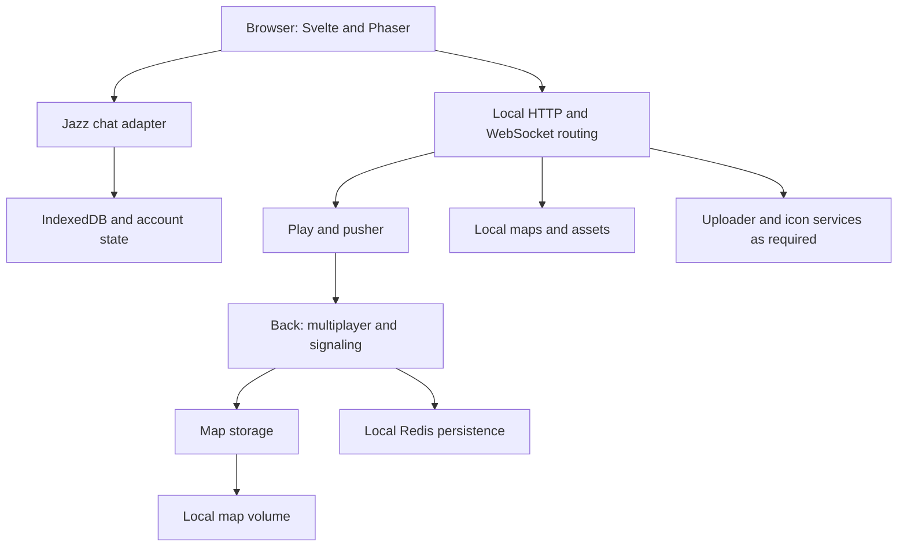

# Local-first WorkAdventure and Jazz Migration Audit

> Date: 2026-09-20
> Scope: Audit of the supplied architecture report and the current fork. Recommendations only; no implementation changes.
> Reviewed checkout: `529dd0a2b8aa6ed1edfa29d303f00ecccde80bb3`.
> Comparison: locally available `upstream/master`, `6a3595710e26021ce3331b897f9db85eb26699a1` (2026-09-11). No remote fetch was performed.
> Decision: Adopt a separate local deployment namespace and reuse upstream Dockerfiles. Do not yet describe the whole application as offline-capable or the Jazz adapter as production-ready multi-user chat.

## Executive Summary

Your report is directionally correct. The strongest recommendations are:

1. Introduce explicit Jazz local/peer/cloud policy, with no cloud fallback in local mode.
2. Keep the normal WorkAdventure services initially rather than rewriting multiplayer immediately.
3. Own local deployment configuration under `deploy/local-first/`, separately from upstream Compose definitions.
4. Reuse upstream build recipes and avoid copying five Dockerfiles.
5. Qualify a supported Jazz sync server before packaging a LAN service.

However, the report is primarily a deployment plan, not yet a complete local-first architecture plan. Containers running on a Mac do not make every browser's data local-first. The current fork still needs decisions about identity, recoverability, shared room discovery, authorization, offline behavior, and which system owns each data domain.

**Recommended first release:** a local-hosted WorkAdventure stack with single-browser, local-first Jazz chat. Retain local server persistence for maps and persistent variables. Explicitly exclude multi-device chat, private messaging, and browser-only offline gameplay until their acceptance gates pass.

**Recommended long-term goal:** Jazz owns durable collaborative application data through narrow adapters. WorkAdventure continues to own real-time simulation/signaling unless a separate replacement is justified. “Everything through Jazz” should not mean encoding video streams, every movement update, and every server responsibility into durable CoValues.

## 1. Method and Evidence Limits

- Used CodeGraph as the primary code discovery tool in two architecture explorations: Jazz/runtime/storage, then chat/connection/variable repository flows.
- CodeGraph reported a 2,072-file index. This audit did not rebuild the index or independently verify the supplied 24,175-symbol / 70,169-edge totals. Index size is not a correctness or test-coverage guarantee.
- Used targeted source reads for gaps in CodeGraph excerpts, configuration, installed Jazz/cojson implementation, and read-only Git comparisons.
- Installed `play/node_modules/jazz-tools/package.json` and `node_modules/cojson-transport-ws/package.json` both report `0.20.10`.
- The working tree was clean before the audit. The only intended output is this report.
- No builds, dependency installations, Docker runs, browser sessions, network isolation tests, or data migrations were performed. Runtime and production-readiness conclusions remain acceptance criteria, not verified test results.
- No current external Jazz support policy was checked. The production sync-server recommendation is deliberately a research gate, not a claim that no supported server exists.
- `docs/spec.md` is still a draft placeholder; it does not yet define the product's offline or migration contract.

## 2. Audit of the Supplied Report

| Claim / recommendation | Assessment | Correction or qualification |
|---|---|---|
| Jazz 0.20.10 can use IndexedDB with `sync: { when: "never" }` | Confirmed in installed source | This disables Jazz WebSocket synchronization, not all application networking. |
| Missing Jazz peer falls back to Jazz Cloud | Confirmed on the normal game path | `GameManager` normalizes blank peers to undefined; `JazzRuntime` then generates a cloud URL, even without an explicit API key. |
| A local/peer/cloud mode is the first change | Agree | Also handle context lifecycle, validation, unavailable remote IDs, storage errors, and honest connection status. |
| WorkAdventure cannot be just a static frontend | Correct for the normal full-feature path; too absolute for this fork | The fork already has a frontend-only mock runbook and Vite middleware tests. That is a reduced development path, not proof of production multiplayer/editor parity. |
| Keep eight local services | Reasonable conservative baseline | It is not a proven minimal topology. Maps/editor/uploads/icon service requirements depend on enabled features. A reverse proxy is a deployment choice, not a database requirement. |
| Redis volume makes shared state and uploads durable | Incomplete | Persistence policy, eviction, expiry, backup, and recovery matter. Redis does not persist all room/simulation state. |
| Mount map-storage at `/maps` | Correct for the inspected production image | The image sets `STORAGE_DIRECTORY=/maps`; source outside that image defaults to `./public`. Verify the effective path and write permissions. |
| A shared Jazz peer enables LAN chat | Incomplete | Clients also need a common room ID, identity, permissions, and persistent room discovery. A peer alone does not create these. |
| `JAZZ_SYNC_PEER=ws://jazz-sync:...` is a LAN browser setting | Incorrect as a normal browser URL | Docker service DNS is for containers. Browsers need a host/LAN-reachable URL, generally `wss://` through trusted HTTPS routing. |
| Local mode works offline after assets are available | Overstated | Full gameplay still needs local HTTP/WebSocket services. A LAN client that loses the LAN cannot assume full game operation. Warm assets do not prove offline reload. |
| Only three existing Docker-related upstream files changed | Confirmed for the three listed deployment files | All five listed Dockerfiles are unchanged in the fork's merge-base diff. Root `.env.template` also changed; the overall fork is much wider than deployment plumbing. |
| New Compose now; Bake later | Agree | Bake is a build orchestration convenience, not a prerequisite for local-first behavior. |
| Never ship the package's test sync server | Agree | Installed transport contains `src/tests/syncServer.ts` and `dist/tests/syncServer.js`; this does not establish a supported production service contract. |
| Earlier build failure proves deployment, not Jazz, was the problem | Not established by this audit | The tracked production review is still a pending template, not an acceptance receipt. Retain concrete logs before assigning root cause. |

The existing `docs/researches/20260920-local-first-container-architecture.md` recommends a root Compose overlay on the development/E2E stack. Your newer supplied report recommends an independent `deploy/local-first/compose.yml`. **Prefer the newer standalone proposal.** Do not implement both competing designs; designate the chosen decision in a later implementation task. This audit leaves the earlier document unchanged.

## 3. Priority Findings

### F1 — Current Jazz startup is not local-only

**Priority: P0 for the local-only release.**

Evidence:
- `play/src/front/Chat/Connection/Jazz/JazzRuntime.ts:113–130` creates a context with a resolved peer and `when: "always"`.
- `JazzRuntime.ts:268–270` falls back to `wss://cloud.jazz.tools` and a default key string.
- `play/src/front/Phaser/Game/GameManager.ts:353–360` normalizes blank configuration before constructing the adapter.

Recommendation:
- Introduce a validated discriminated policy, not independent loosely interpreted strings.
- `local`: pass `sync: { when: "never" }`; never create a remote peer.
- `peer`: require a browser-reachable `ws:`/`wss:` URL; never fall back to cloud.
- `cloud`: explicit opt-in, with a documented key and data-sharing policy.
- Have the local distribution explicitly set local mode. Define legacy/default behavior for other distributions rather than silently changing every deployment.
- Reject contradictory local-plus-peer settings, or explicitly ignore them with a clear warning. Document one behavior.

Adding a Compose variable alone will not work. Configuration must cross the pusher validator/export, `FrontConfigurationInterface`, frontend environment export, `GameManager`, connection options, and runtime config. The new deployment namespace does not eliminate these small application-code changes.

### F2 — Shared room discovery is not implemented by sharing a sync peer

**Priority: P0 before LAN chat.**

Evidence:
- `JazzRuntime.resolveRoomId()` uses an explicit ID or browser localStorage, otherwise creates a new room.
- `JazzChatConnection.init()` stores the main room ID under `wa:jazz:main:...`.
- `JazzChatConnection.createDirectRoom()` derives a localStorage key from sorted user IDs, but still allocates a random Jazz room when the key is absent.
- `JazzChatConnection.createRoom()` adds rooms to in-memory stores without persisting a discoverable room directory on that path.

Consequences:
- Two fresh browsers visiting the same WorkAdventure room do not automatically select the same Jazz room.
- Matching localStorage key strings do not make two generated CoValue IDs equal.
- `JAZZ_GLOBAL_ROOM_ID` can bootstrap a shared room in synchronized mode, but is not a complete world-to-room registry or private messaging design.
- In local mode, an explicit ID that only exists remotely cannot be loaded from a peer.
- Additional rooms and room names need durable discovery; persisting message objects alone is insufficient.

Recommendation: introduce stable world/room identity plus a persistent room directory. Use a per-account root for private room references and authorized shared world metadata for shared rooms. Resolve concurrent room creation explicitly. Do not use a deployment-wide global room ID as the permanent routing model.

### F3 — The Jazz adapter is not a secure private-chat replacement

**Priority: P0 before LAN/cloud/private data, not a blocker for a clearly labeled isolated prototype.**

Evidence:
- `JazzRuntime.createRoom()` calls `Group.create()`, `makePublic?.()`, and `addMember?.("everyone", "writer")` for rooms, including those reached through the direct-room creation flow.
- `schema.ts` stores `senderId` and `senderName` as strings; those fields alone do not authenticate authorship.
- `JazzChatRoom.ts` returns false for moderation permissions; invite/kick/ban operations inspected are no-ops. Leaving changes local membership state, not underlying access.
- `JazzChatRoomMember.ts` presents members as `ADMIN`, which is not an enforced Jazz role model.

Recommendation:
- Define Jazz account identity, recovery, and the binding to WorkAdventure identity before shared sensitive data.
- Do not treat anonymous WorkAdventure login and Jazz account ownership as interchangeable.
- Use least-privilege groups and real invite/revocation flows. Public writer rooms must be intentional public spaces, not the implementation of DMs.
- Verify author/edit/delete policy against actual Jazz permissions, not only UI controls or mutable sender strings.
- Disable unsupported actions through explicit capabilities rather than presenting no-op operations as successful.
- Remember revocation cannot make a formerly authorized offline replica forget already-read data.

### F4 — Local persistence is not the same as recoverability

**Priority: P0 for release data-loss expectations.**

Browser IndexedDB is useful local storage, but browser-profile loss, storage clearing, quota pressure, and origin changes remain risks. A Docker backup does not include the browser's Jazz account secrets, IndexedDB, or room pointers.

`JazzRuntime.getItem()` and `setItem()` swallow localStorage errors. A room can be created without its pointer being recoverably stored. `destroy()` clears room subscriptions, but does not own/dispose the context manager. A global readiness boolean ignores subsequent configuration changes, and initialization swallows errors whose messages match `already|existing|initialized`.

Recommendation:
- Define a stable origin and intentional account/context lifecycle; mode or identity changes must not reuse an incompatible global context silently.
- Surface persistence failures and unloaded/unavailable room states.
- Separate “ready for local use,” “saved locally,” and “synced to peer” in user-visible state. Current `ONLINE` is set after subscription setup, not proof of peer connectivity or loaded data.
- Provide a tested supported export/restore and account-recovery workflow. Include room discovery metadata and attachments.
- Request persistent browser storage where appropriate, but do not advertise it as a backup guarantee.

Installed cojson `sync.ts:1545–1556` shows `waitForSync()` waits for applicable peers **and** storage synchronization. With no peers it still has a storage wait; it is not inherently a cloud requirement. However, write completion and crash recovery for room creation, text, edits, and images must be tested in the adapter. Its message mutation methods do not explicitly await a durability receipt.

### F5 — Local servers are still authoritative for non-Jazz domains

**Priority: P0 for accurate product scope; P1 for later migration.**

- `ConnectionManager.anonymousLogin()` calls `anonymLogin`; room connection remains a networked flow.
- `MapEditorModeManager.subscribeToRoomConnection()` consumes server edit command messages and errors.
- Shared and player variable repository factories select Redis implementations or warn that variables will not be persisted.
- `map-storage/src/fileSystem.ts` selects S3 or disk; moving this service locally changes hosting, not browser write semantics.

Therefore the first release is a **hybrid**. On the host machine it can work without the public Internet while local services remain reachable. On a LAN client, maps, gameplay, and server-owned writes remain dependent on the host.

Do not route the same domain's writes independently to Redis/map-storage and Jazz. That creates competing sources of truth with undefined conflict and rollback semantics.

### F6 — Redis and uploads require an explicit durability policy

**Priority: P1 before calling the local stack production-ready.**

- `uploader/src/Service/RedisStorageProvider.ts` uses `SET` for normal uploads and `EXPIRE` for temporary audio data.
- Persistent player-variable interfaces also include expiry semantics.
- The inspected upstream production Redis service mounts `/data`, but does not itself declare an explicit AOF policy in that service block.

A named volume preserves files that Redis writes; it does not guarantee every acknowledged write survives a crash. Choose and test AOF/RDB behavior, acceptable loss window, eviction policy, memory limits, expiry, backup, and restore. For example, AOF `everysec` still allows a recent-write loss window.

For a small prototype, local Redis-backed uploads are reasonable. Do not make an unbounded in-memory binary store the assumed long-term media architecture. Jazz chat images already use `jazz-tools/media`; non-Jazz uploads need their own inventory and migration plan.

### F7 — Offline acceptance needs more than blank environment variables

**Priority: P1.**

Literal `MATRIX_*=""`, `OIDC_*=""`, or `SENTRY_*=` notation is not executable configuration. Enumerate supported keys and verify empty-string handling. Some validators expect valid URLs or normalize empty values differently.

Map JSON/WAM references, tilesets, scripts, embeds, avatar assets, icon lookup, media, telemetry, and optional integrations can introduce external traffic independently of Jazz configuration. A local icon server may still fetch remote content depending on the requested icon.

Define two separate policies:
1. No required Internet service for core operation.
2. No unsolicited outbound Internet traffic at all.

The second needs browser **and container** egress observation, a local asset inventory, and preferably an enforced allowlist. A blocked cloud request must not leave the UI waiting forever.

## 4. Recommended Architecture

### Phase A: Local distribution without changing the game protocol



In local Jazz mode there is no Jazz network peer. This means a local chat history/workspace, **not synchronized chat between two browsers**, even if both connect to the same WorkAdventure server.

Keep initially:
- `play`, `back`, local map assets, and routing for the normal game flow;
- `map-storage` when editor/persistent map functionality is in scope;
- Redis when durable variables or uploader storage are in scope;
- uploader/icon services until feature and network tests show they can be omitted.

Matrix, OIDC, video infrastructure, diagnostics tools, and public integrations should not be default dependencies. Anonymous editing/auth policy still needs explicit validation; disabling OIDC alone does not prove desired editor permissions.

### Phase B: LAN synchronization

Add a protocol-compatible, durably stored Jazz sync service only after room identity and permissions work.

Required decisions:
- Browser-facing origin and `wss://` routing versus container-internal service URLs.
- Stable host naming; changing hostnames/ports can strand browser-origin-scoped data.
- Trusted HTTPS for LAN clients. `localhost` secure-context exceptions do not generally apply to plain-HTTP LAN IPs; camera/microphone and other browser capabilities need verification.
- Jazz account provisioning/recovery and secure room invitation.
- Sync retention, disk quotas, backup, restart behavior, and peer outage behavior.
- Supported server package/image, license, architecture support, protocol version, upgrade procedure, and operational owner.

Do not infer a custom server is necessary merely because the installed transport package exposes a test server. Prefer a maintained compatible implementation. If none can be qualified, defer LAN rather than quietly turning a transport example into production infrastructure.

### Phase C: Jazz as the durable application data layer

Use domain boundaries rather than adding Jazz imports throughout Phaser, Svelte components, and server controllers.

| Domain | Initial owner | Proposed later owner / boundary |
|---|---|---|
| Chat text, images | Jazz adapter | Jazz room/message model with enforced authorization |
| Account and profile | Existing WorkAdventure identity plus Jazz context | Explicit Jazz identity model and deliberate WorkAdventure identity mapping |
| Room directory, memberships, invitations | Partial local/in-memory adapter state | Authorized Jazz account/world roots |
| User preferences and inventory | Inventory required before migration | Account-scoped Jazz data where justified |
| Persistent shared/player variables | Back repository interfaces + Redis | Jazz-backed repository adapters after access, expiry, and conflict semantics are specified |
| Map documents and editor edits | Map-storage + server command path | Jazz document model behind a WorkAdventure map/editor compatibility adapter |
| Map assets and non-chat uploads | Map service, disk/S3/Redis paths | Jazz media or retained local blob service with explicit export/GC policy |
| Player position, proximity, transient room state | Back real-time engine | Retain initially; evaluate transient presence separately from durable data |
| Audio/video and TURN relay | WebRTC/media infrastructure | Retain suitable media transport; Jazz may hold metadata, not video payload streams |
| Secrets and trusted authorization | Server/configuration boundaries | Remain outside public client configuration and public CoValues |

Use the existing `ChatConnectionInterface`, `VariablesRepositoryInterface`, `PlayersVariablesRepositoryInterface`, and map-storage `FileSystemInterface` where their contracts fit. Do not force a filesystem-only interface to represent a collaborative map command protocol: map editing needs a deliberate compatibility boundary, ordering, validation, and export semantics.

For each migration:
1. Specify domain ownership, stable IDs, schema version, access rules, and offline write semantics.
2. Define conflict behavior for concurrent edits/deletes, not merely “CRDTs merge it.”
3. Implement a narrow adapter with contract tests.
4. Import existing data with idempotent ID mapping and a resumable migration marker.
5. Validate completeness; optionally compare old and new reads during a bounded transition.
6. Cut over writes to exactly one authority.
7. Define rollback before cutover. Restoring an old image is insufficient after new-format writes without reverse migration/export.
8. Remove the obsolete domain path after the agreed migration window. Avoid permanent dual-write compatibility layers.

Existing Matrix history is a separate migration scope. Replacing the provider does not automatically migrate messages, attachments, memberships, or permissions.

## 5. Deployment and Upstream Maintenance

### Choose Option A now; introduce Option B when packaging requires it

Proposed layout, **not created by this audit**:

```text
deploy/local-first/
  compose.yml
  compose.lan.yml
  compose.video.yml
  .env.example
  README.md
  scripts/
  tests/
  docker-bake.hcl       # later, when a separate build/release pipeline pays off

services/jazz-sync/     # only if a qualified deployment actually needs an in-repo service
```

Best practices:
- Build the modified fork, not published upstream images that lack fork functionality.
- Reuse upstream production Dockerfiles without copying them.
- Keep Compose self-contained; do not inherit the development/E2E stack and try to disable every unwanted service through fragile merge behavior.
- Validate resolved configuration, profiles, build contexts, runtime URLs, internal RPC addresses, auth secrets, permissions, and health/readiness behavior.
- Use root context for inspected `play`, `back`, `map-storage`, and `uploader` recipes. **Do not blindly apply it to `maps`:** the existing E2E definition uses `maps/` context, and `maps/Dockerfile` copies `.` into its image.
- Treat the Dockerfiles as upstream-owned, not frozen forever. Accept compatible upstream updates and verify their contracts.
- Pin release image identities/digests, record lockfiles and source revision, and check base-image support/security. Reusing upstream recipes is not proof that old base images or all targets are supported on Apple Silicon.
- Keep secrets in ignored local operation material, not tracked examples or frontend configuration.
- Bind private services to internal networks; expose only required endpoints. LAN access is not a reason to publish Redis or gRPC ports.

### What the Git comparison actually establishes

The three listed upstream deployment files contain Jazz environment plumbing (plus removal of a trailing blank line in the production env template). All five named Dockerfiles have no fork changes relative to the merge base with the local upstream ref.

But the full fork comparison reports **558 files changed, 33,592 insertions, and 5,080 deletions**. These are snapshot-specific Git diff statistics, not a claim about conflict count. There are substantial changes outside Docker, including chat UI, environment/configuration, dependencies, localization, and mock-mode work.

Therefore deployment isolation is valuable but **not sufficient** to make upstream updates cheap. Keep:
- a small, documented integration surface;
- separate changesets for Jazz adapters, local deployment, localization, and unrelated tooling/UI work;
- upstream provider/API contract tests and a fork local-first release gate;
- an inventory of fork-owned paths and upstream touchpoints;
- dependency/protobuf/build validation after upstream service changes.

Do not revert the three existing Compose/env changes automatically. First move their required behavior to the new distribution, preserve any still-supported workflows, and verify parity. A revert is a later scoped change, not part of this audit.

For update workflow, merge upstream into shared integration history; use rebase for unpublished/private changes when appropriate. Do not routinely rewrite a branch other people consume. The next real update should fetch upstream, record the exact revision, run the compatibility checks, and evaluate data/schema migrations before release.

### Offline distribution is a separate deliverable

A Docker image bundle supports installation without pulling runtime images. It does not automatically provide:
- an installed compatible container runtime;
- a complete air-gapped source build toolchain/package cache;
- seeded maps/assets and browser data;
- trusted LAN certificates;
- backup restoration or account recovery.

Ship an architecture-specific tested image manifest, checksums, import/start instructions, seeded assets, and recovery instructions. Test first installation with no Internet. Do not require online ACME issuance for an air-gapped local deployment.

## 6. Suggested Work Sequence and Exit Gates

| Stage | Deliverable | Exit gate |
|---|---|---|
| 0 | Product contract and accepted architecture decision | Define single-machine vs LAN vs browser-only, feature scope, data ownership, durability, and recovery expectations. |
| 1 | Explicit Jazz mode and lifecycle | Local mode creates no Jazz socket; fresh account, reload, text/images, storage failure, and unavailable remote-ID behavior are tested. |
| 2 | Standalone local deployment | Source-built images start with local URLs, seeded maps, correct writable volumes, and only declared services. No existing Docker/Compose edits required by this deployment task. |
| 3 | Single-device release gate | Internet disconnected but loopback retained: core map/chat work; persistence and restore succeed; network audit meets the chosen egress policy. |
| 4 | Shared Jazz domain foundation | Stable room registry, account binding, real membership/permissions, capability-aware UI; DMs are not public writer groups. |
| 5 | Qualified LAN sync and optional video | Two independent browsers discover the same authorized room, synchronize, survive partition/reconnect/server restart, and use trusted browser-reachable endpoints. |
| 6 | Durable-domain migration | One domain at a time, schema/adapter/import/rollback tested; no indefinite dual source of truth. |
| 7 | Air-gapped packaging | Fresh install and restore from the bundle with Internet unavailable. |

TypeScript compatibility and Russian localization can remain prior work, but this audit did not rerun their checks and does not re-certify their completed status. Local-first E2E should exercise the selected locale and generated artifacts in actual production images.

## 7. Required Test Matrix

### Runtime and offline behavior

- Local Jazz mode: no cloud or LAN Jazz socket, even with stale peer/key configuration.
- Peer mode: missing/invalid peer fails clearly, never falls back to cloud.
- Cloud mode: remains explicit and separately tested if supported.
- Block Internet while retaining loopback/local service access; separately disconnect a LAN client from its host. Document the different supported outcomes.
- Cold start/reload with the local stack; do not confuse a warm loaded tab with offline-install or offline-reload support.
- If browser-only operation becomes a requirement, add a separate asset cache/service-worker and local command execution design. The current mock mode is useful test infrastructure, not that implementation.

### Data durability and recovery

- Send text/image, edit/delete, reload, restart browser, and verify expected state.
- Restore a supported browser/Jazz backup into a fresh profile; verify account access and room discovery, not just message bytes.
- Exercise localStorage/IndexedDB denial, quota errors, stale room pointers, and unavailable images.
- Restart and crash Redis/map-storage separately; measure data loss against the declared policy.
- Restore named-volume backups into a fresh deployment. Include account recovery outside container backups.
- Confirm intentional TTL expiry is not mistaken for a persistence defect.

### LAN and authorization

- Two isolated profiles; no copied localStorage shortcuts in the acceptance test.
- Shared room discovery, invitation, private room access, unauthorized write/edit/delete attempts.
- Offline edits on both clients, reconnect, concurrent room creation, and deletion/edit conflicts.
- Sync server unavailable at startup, restarted, or restored from backup.
- Trusted HTTPS, browser-reachable peer URL, and optional camera/microphone without public STUN.

### Compatibility and production packaging

- Build from a clean checkout: protobuf, Room API artifacts, i18n, and assets must not depend on untracked workstation output.
- Validate resolved Compose configuration and intended build contexts; check target architecture for every image.
- Upstream baseline build/contract checks plus the fork's local-first E2E suite. Matrix/OIDC-specific suites are not substitutes for the local profile.
- Browser and container network logs verify telemetry, scripts, maps/assets, icon requests, and integrations against the egress policy.
- Upgrade and rollback tests include persistent schema changes, not just image replacement.

## 8. Evidence Index

Paths below are relative to the repository root. Installed dependency paths describe this checkout and are not proposed source files to modify.

| Evidence | Relevant path / symbol |
|---|---|
| Cloud fallback, context lifecycle, room creation, storage pointers | `play/src/front/Chat/Connection/Jazz/JazzRuntime.ts` |
| Room initialization, direct-room allocation, volatile room lists | `play/src/front/Chat/Connection/Jazz/JazzChatConnection.ts` |
| Membership/moderation stubs | `play/src/front/Chat/Connection/Jazz/JazzChatRoom.ts` |
| Displayed admin membership | `play/src/front/Chat/Connection/Jazz/JazzChatRoomMember.ts` |
| Message model | `play/src/front/Chat/Connection/Jazz/schema.ts` |
| Provider configuration entry | `play/src/front/Phaser/Game/GameManager.ts`, `getChatConnection()` |
| Frontend configuration contract | `play/src/common/FrontConfigurationInterface.ts`; `play/src/front/Enum/EnvironmentVariable.ts` |
| Pusher configuration | `play/src/pusher/enums/EnvironmentVariableValidator.ts`; `play/src/pusher/enums/EnvironmentVariable.ts` |
| Normal server login dependency | `play/src/front/Connection/ConnectionManager.ts`, `anonymousLogin()` |
| Server-driven editor flow | `play/src/front/Phaser/Game/MapEditor/MapEditorModeManager.ts`, `subscribeToRoomConnection()` |
| Redis/void persistence selection | `back/src/Services/Repository/VariablesRepository.ts`; `back/src/Services/PlayersRepository/PlayersVariablesRepository.ts` |
| Persistence interfaces and expiry | `back/src/Services/Repository/VariablesRepositoryInterface.ts`; `back/src/Services/PlayersRepository/PlayersVariablesRepositoryInterface.ts` |
| Disk fallback | `map-storage/src/fileSystem.ts`; `map-storage/src/Enum/EnvironmentVariableValidator.ts` |
| Redis binary uploads/expiry | `uploader/src/Service/RedisStorageProvider.ts` |
| IndexedDB before network setup | `play/node_modules/jazz-tools/src/browser/createBrowserContext.ts`, `setupPeers()` |
| Supported sync union | `play/node_modules/jazz-tools/src/tools/types.ts`, `SyncConfig` |
| Storage-inclusive synchronization wait | `play/node_modules/cojson/src/sync.ts`, `waitForSync()` |
| Test-only server artifact | `node_modules/cojson-transport-ws/src/tests/syncServer.ts` |
| Existing reduced frontend path | `LOCAL_FRONTEND_ONLY.md`; `play/tests/front/MockMode/frontendOnlyMockPlugin.test.ts` |
| Production build boundaries | `play/Dockerfile`, `back/Dockerfile`, `map-storage/Dockerfile`, `maps/Dockerfile`, `uploader/Dockerfile` |
| Existing source-build context conventions | `docker-compose.e2e.yml` |
| Existing production Redis volume | `contrib/docker/docker-compose.prod.yaml:279–283` |
| Earlier, conflicting deployment recommendation | `docs/researches/20260920-local-first-container-architecture.md` |
| Pending production review, not proof of a root cause | `tasks/reviews/20260920-1516-build-and-production-test-full-workadventure-on-macbook.review.md` |

## Final Recommendation

**Approve the deployment direction, with conditions.** Use a standalone local Compose namespace and upstream Dockerfiles. First prove a useful, recoverable single-device experience without Internet dependencies. Before adding LAN, fix shared room discovery, identity, authorization, and context lifecycle. Then move durable domains into Jazz through explicit adapters and bounded migrations.

The architectural priority is not a new Dockerfile. It is **clear ownership of data, enforceable access, recoverable local state, and a small tested integration boundary with upstream WorkAdventure**.
